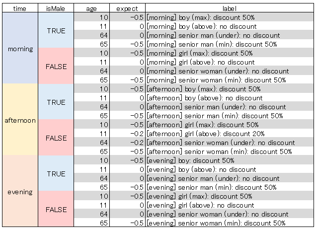

# Data Matrix

[](https://badge.fury.io/js/%40working-sloth%2Fdata-matrix)
[](https://travis-ci.org/work-work-komei/node.data-matrix)
[](https://app.codacy.com/app/work-work-komei/node.data-matrix?utm_source=github.com&utm_medium=referral&utm_content=work-work-komei/node.data-matrix&utm_campaign=Badge_Grade_Dashboard)
[](https://codecov.io/gh/work-work-komei/node.data-matrix)
[](LICENSE)



日々怠ける処の開発者、日没すれども帰れぬ処の社畜開発者に致す。
UTのために長くて冗長なコードをたくさん生産することがあなたの仕事ですか？
怠けましょう
<table>
    <tr>
        <th>Write all<br>(Before)</th>
        <td style="padding: 0">
            <div>
                Too long and duplicated
<pre style="margin: 0">
it('[morning] boy (max): discount 50%', () => {
    const service = new FooService();
    const discount = service.calcDiscount('morning', true, 10);
    expect(discount).toEqual(-0.5);
});
it('[morning] boy (above): no discount', () => {
    const service = new FooService();
    const discount = service.calcDiscount('morning', true, 11);
    expect(discount).toEqual(0.0);
});
it('[morning] senior man (under): no discount', () => {
    const service = new FooService();
    const discount = service.calcDiscount('morning', true, 64);
    expect(discount).toEqual(0.0);
});
...
</pre>
</div>
        </td>
    </tr>
    <tr>
        <th>List<br>(Before)</th>
        <td style="padding: 0">
            <div>
                Still duplicated
<pre style="margin: 0">
const tests = [
    { time: 'morning', isMale: true, age: 10, expect: -0.5, label: '[morning] boy ...' },
    { time: 'morning', isMale: true, age: 11, expect: 0.0, label: '[morning] boy ...' },
    { time: 'morning', isMale: true, age: 64, expect: 0.0, label: '[morning] senior ...' },
    ...
];
for (const test of tests) {
    it(test.label, () => {
        ...
</pre>
            </div>
        </td>
    </tr>
    <tr>
        <th>Data matrix<br>(After)</th>
        <td style="padding: 0">
            <div>
                Readable and no duplication
<pre style="margin: 0">
const tests = buildDataMatrix([
    [
        ['time',        'isMale',   'age',  'expect',   'label']
    ], [//-------------------------------------------------------
        ['morning',     true,       10,     -0.5,       '[morning] boy ...'],
        [                           11,     0.0,        '[morning] boy ...'],
        [                           64,     0.0,        '[morning] senior ...'],
    ...
    ]
])
for (const test of tests) {
    it(test.label, () => {
        ...
</pre>
            </div>
        </td>
    </tr>
</table>

## 概要
 JavaScriptとTypeScript用のデータリスト作成ツールです

## 特徴
- コードを少なく: もうUTのために冗長なコードを書く必要がありません
- 読みやすい: コードが減るのでテストケースを理解しやすく、間違いも気づきやすくなります
- でも学習コストがお高いんでしょ？: 基本機能は１ステップ、全機能は５ステップのみで習得できます

## Quick start
```js
import { buildDataMatrix } from '@working-sloth/data-matrix';

// define test param
type Test = { time: string, isMale: boolean; age: number, expect: number, label: string };
// buildDataMatrix<T> convert the matrix to test list
const tests = buildDataMatrix<Test>(
    [
        ['time',        'isMale',   'age',  'expect',   'label'] // Header
    ], [//-------------------------------------------------------
        // Lacking values will be filled from LEFT to RIGHT with previous value
        ['morning',     true,       10,     -0.5,       '[morning] boy (max): discount 50%'],
        [/*morning*/    /*true*/    11,     0.0,        '[morning] boy (above): no discount'],
        [                           64,     0.0,        '[morning] senior man (under): no discount'],
        [                           65,     -0.5,       '[morning] senior man (min): discount 50%'],
        [               false,      10,     -0.5,       '[morning] girl (max): discount 50%'],
        [               /*false*/   11,     0.0,        '[morning] girl (above): no discount'],
        ...
    ]
);

// Test loop
for (const test of tests) {
    it(test.label, () => {
        // Given
        const service = new FooService();
        // When
        const discount = service.calcDiscount(test.time, test.isMale, test.age);
        // Then
        expect(discount).toEqual(test.expect);
    });
}
```

## 他のサンプル
 真に驚くべきサンプルがあるが、ここに書くには余白が狭すぎる
 [See samples](samples)

## Schedule
- ドキュメントの充実: 明日やる
- VS Code向け拡張機能（マトリックス整形、ヘッダ生成）の提供: 明日やる
- 休憩: 毎日
- おふとん: 毎日
- 有能な怠け者になる: もうすぐ
- 無能な働き者になる: 一昨日

## ご満足いただけなかった場合
 contact: koba.work.work1127@gmail.com
