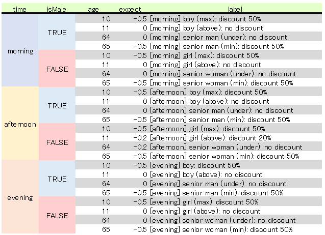

# Data Matrix

Diligent developer, is it your work to crete many lengthy code for unit tests?
Let's be lazy.
<table>
    <tr>
        <th>Write all (Before)</th>
        <td>
<pre>
it('[morning] boy (max): discount 50%', () => {
    const service = new FooService();
    const discount = service.calcDiscount('morning', true, 10);
    expect(discount).toEqual(-0.5);
});
it('[morning] boy (above): no discount', () => {
    const service = new FooService();
    const discount = service.calcDiscount('morning', true, 11);
    expect(discount).toEqual(0.0);
});
it('[morning] senior man (under): no discount', () => {
    const service = new FooService();
    const discount = service.calcDiscount('morning', true, 64);
    expect(discount).toEqual(0.0);
});
...
</pre>
        </td>
    </tr>
    <tr>
        <th>Test case list (Before)</th>
        <td>
<pre>
const tests = [
    { time: 'morning', isMale: true, age: 10, expect: -0.5, label: '[morning] boy (max): discount 50%' },
    { time: 'morning', isMale: true, age: 11, expect: 0.0, label: '[morning] boy (above): no discount' },
    { time: 'morning', isMale: true, age: 64, expect: 0.0, label: '[morning] senior man (under): no discount' },
    ...
];
for (const test of tests) {
    it(test.label, () => {
        const service = new FooService();
        const discount = service.calcDiscount(test.time, test.isMale, test.age);
        expect(discount).toEqual(test.expected);
    });
}
</pre>
        </td>
    </tr>
    <tr>
        <th>Data matrix (After)</th>
        <td>
<pre>
const tests = buildDataMatrix([
    [
        ['time',        'isMale',   'age',  'expect',   'label']
    ], [//-------------------------------------------------------
        ['morning',     true,       10,     -0.5,       '[morning] boy (max): discount 50%'],
        [                           11,     0.0,        '[morning] boy (above): no discount'],
        [                           64,     0.0,        '[morning] senior man (under): no discount'],
    ...
    ]
])
for (const test of tests) {
    it(test.label, () => {
        const service = new FooService();
        const discount = service.calcDiscount(test.time, test.isMale, test.age);
        expect(discount).toEqual(test.expected);
    });
}
</pre>
        </td>
    </tr>
</table>

## What? 
 Data matrix cretor for JavaScript and TypeScript.

## Why? 
- Less code: you don't have to write lengthy code any more for unit test
- Readable: less code helps you to understand test cases and find mistake

## Quick start
